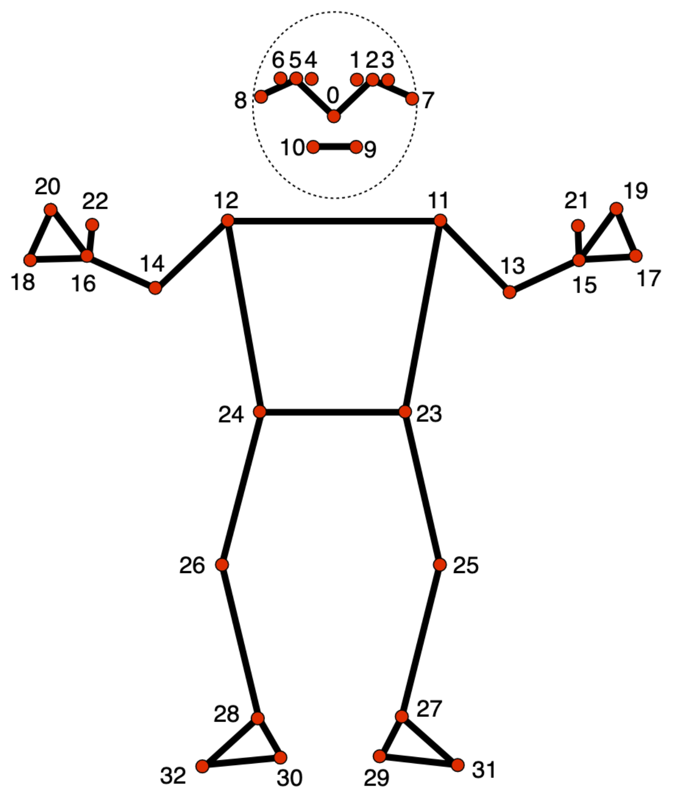

# VirtualSpotter - The Modern Exercise Form Checker

## Repository Structure
```bash
├── README.md
├── pose_landmarks_index.png
├── src
│   ├── form_checkers
│   │   ├── __init__.py
│   │   ├── _angle_calculator.py
│   │   ├── barbell_bentOver_formChecker.py
│   │   ├── benchpress_formChecker.py
│   │   └── squat_formChecker.py
│   ├── main.py
│   ├── pose_estimator.py
│   └── requirements.txt
├── trained_models
└── videos
```

## How to use it
Create a venv and download the required libraries:
```bash
python3 -m venv .venv
source .venv/bin/activate
cd src
pip install -r requirements.txt
```

### Prerequisites
Before the application can be used, pretrained models need to be downloaded from the official [Google AI for Developers Website](https://ai.google.dev/edge/mediapipe/solutions/vision/pose_landmarker/index#models). The application specifically focuses on the ***Full*** and ***Lite*** model bundle to be able to run it on less powerful machines such as your phone. The models should be stored in the **trained_models** directory.

To run the application, follow the next steps:
```bash
cd src
python3 main.py
```

## Pose Landmarker Model
